MedQuery – MVP Architecture

Overview

MedQuery is a multi-mode LLM application with three modes: Ask | RAG | Agent.
It uses a FastAPI backend with JWT authentication, a React (TypeScript + Tailwind) frontend, and Elasticsearch as a vector database.
The system integrates with OpenAI / Azure OpenAI providers and MCP servers for tool-augmented reasoning.

⸻

High-Level Architecture

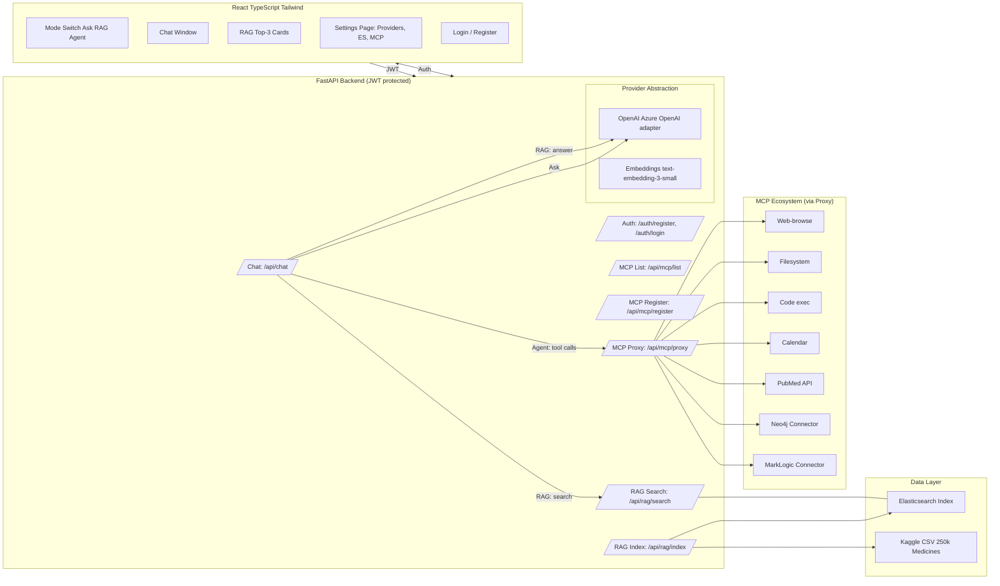

⸻

Flows

Ask Mode
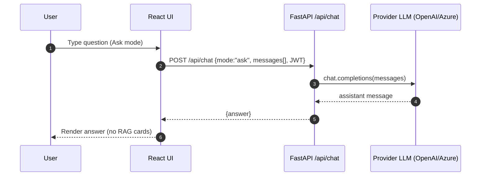
RAG Mode
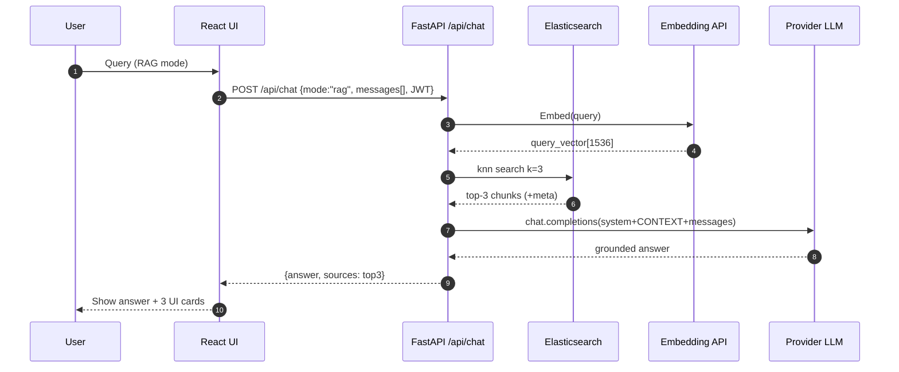
Agent Mode
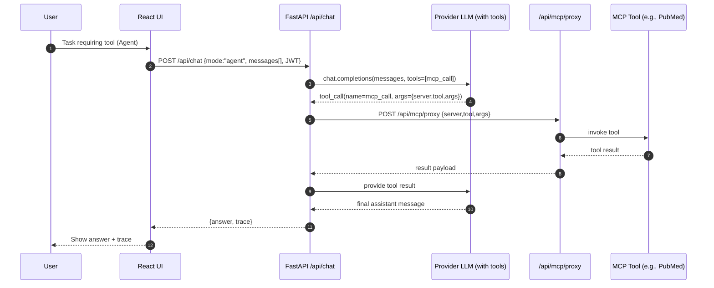

⸻

Data Ingestion
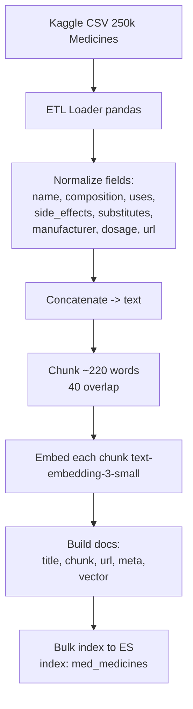

⸻

API Surface
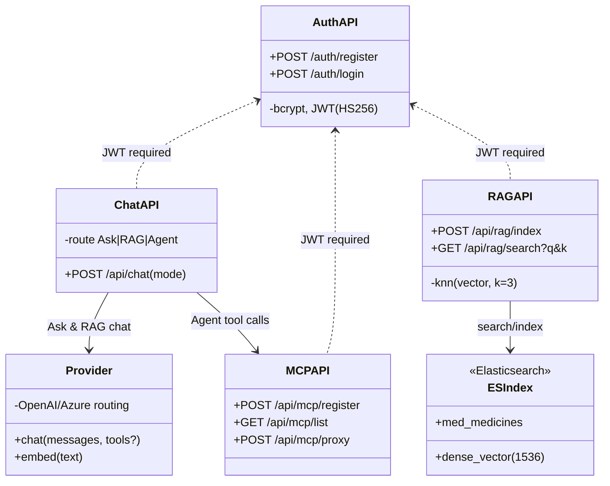

⸻

Frontend Components
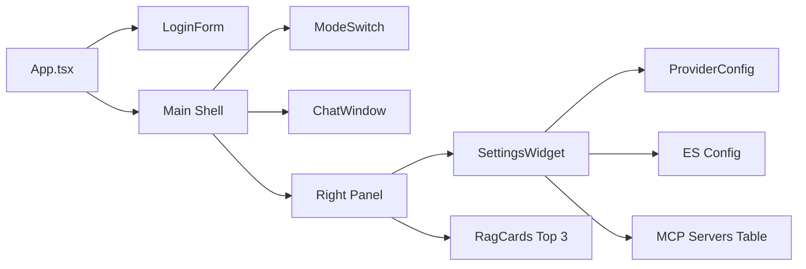

⸻

Auth & Config Flow
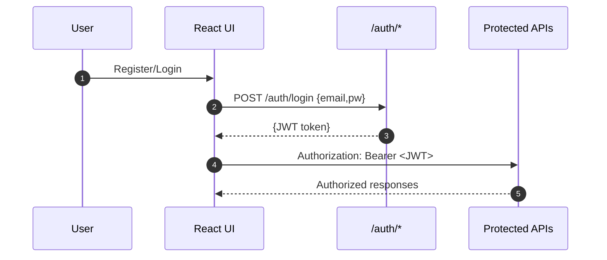

⸻

Data Model
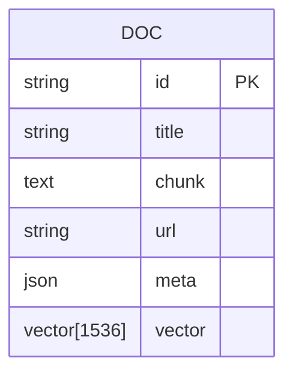

⸻

Deployment Topology
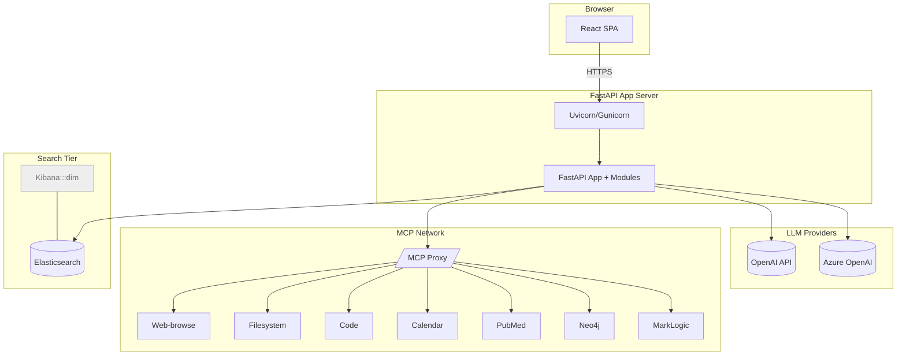

⸻

Error & Fallback Handling
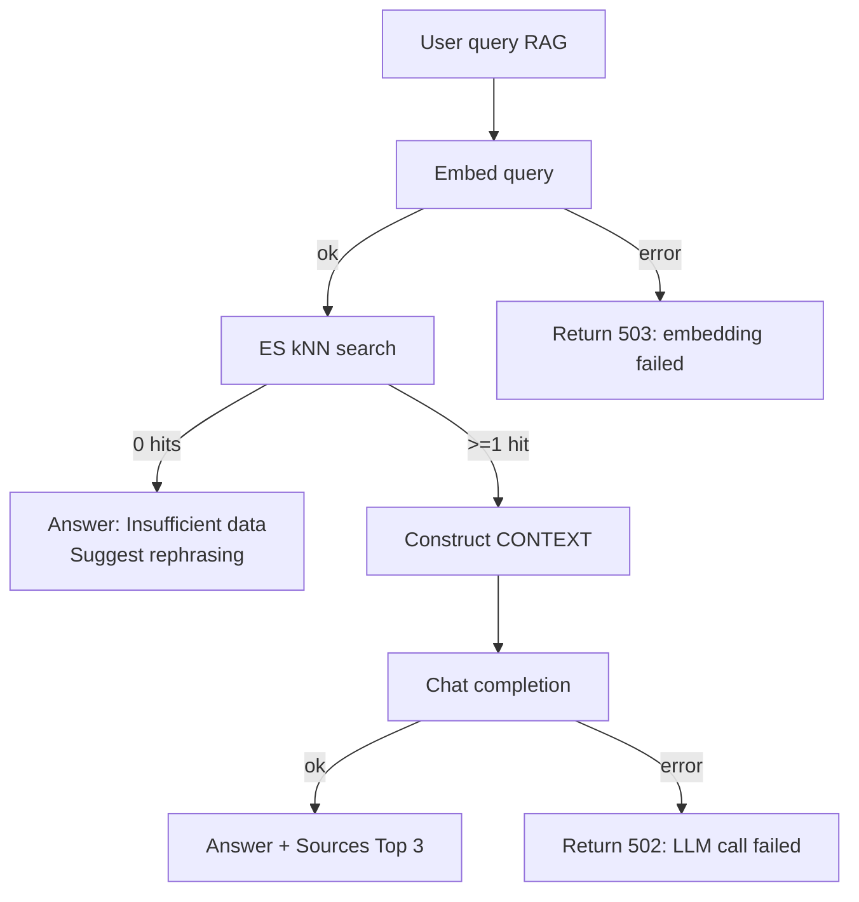